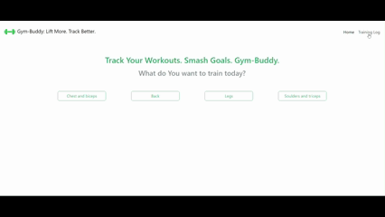

# Gym-Buddy

A simple application to log Your gym workouts!
Allows to add and view training session in a clean and intuitive interface.

## Preview



## Features

- Add a new workout session with date and exercise type
- View a list od saved workouts
- Suble row highlighting on table rows
- Responsive designt using Bootstrap

## Technologies

- **Framework:** Angular
- **Styling:** Bootstrap + Sass

## Installation

1. Clone the repository:

```bash
git clone https://github.com/GosiaZaremba/gym-buddy
```

2. Install dependencies

```bash
cd gym-buddy
npm install
```

3. Run the application in development mode

```bash
ng serve
```
